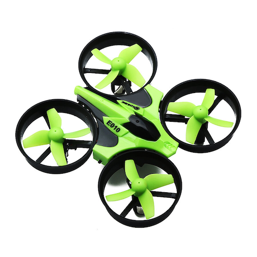
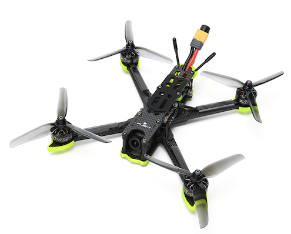
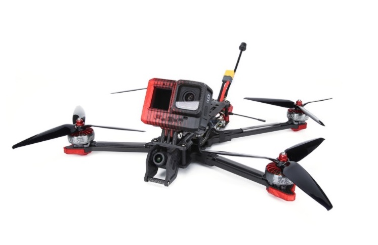
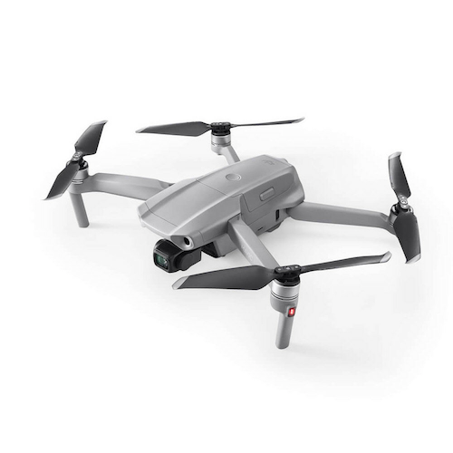

Chi ha un drone vorrebbe poter volare senza mai dover atterrare perchè la batteria è scarica. I progressi tecnologici ci hanno dato tempi di volo che possono arrivare fino a 30 minuti con una singola carica. La necessità del tempo di volo più lungo è particolarmente evidente in coloro che sono interessati alla fotografia aerea oppure nei voli long range.

Lunghi tempi di volo sono essenziali per alcune attività. Le società immobiliari, edili e di rilevamento del territorio sono in grado di sfruttare al meglio i droni che durano a lungo.

Tutta un'altra storia per i droni FPV. L'enorme potenza sprigionata da questi velivoli da corsa fa scaricare la loro batteria in pochi minuti. Infatti questi tipi di drone sono progettati per andare estremamente veloce (anche 200 km/h) su brevi distanze.

Non sai cos'è un drone FPV? Dai un'occhiata a [questo articolo](https://lucafpv.com/significato-fpv).

## Per quanto tempo possono stare in hover i droni?

Il tempo medio di hover nei droni moderni va da 5 a 30 minuti. I droni di solito possono stare in hover più a lungo di quanto possano volare, perché i motori devono solo combattere il peso del drone e non muoverlo. Quindi la batteria si scarica più lentamente. 

## Qual è il tempo medio di volo di un drone?

Tipicamente, 20 minuti è il tempo di volo dei droni più comuni. Tuttavia, quanti minuti può volare un drone dipendono dal prezzo e dal tipo di drone.

|   	                                                                                                                  | Categoria 	                                    | Prezzo 	            | Tempo di volo                                          |
|---	                                                                                                                  |--------------	                                |----------------       |------------------------------------------------   |
|     | Droni giocattolo             | da 20 a 200 euro      | meno di 5 minuti                |
| | Droni FPV  | da 300 a 600 euro     | meno di 7 minuti |
|     | Droni FPV - Long Range   | a partire da 400 euro | circa 20 minuti          |
|      | Droni da fotografia   | a partire da 500 euro | più di 20 minuti          |

## Cosa sono le batterie LiPo?

 Le LiPo sono un tipo di batteria ricaricabile che è presente nel mondo RC da tempo, sono particolarmente utilizzate per il modellismo aereo. 
 
 La maggior parte dei droni utilizza un tipo di batteria chiamata LiPo (Lithium Polymer). Queste batterie hanno rivoluzionato il mondo dell’aviazione elettrica. Il vantaggio di questo tipo di batteria è che sono più dense di energia, fornendo cosi maggiore potenza a parità di peso. 

Le batterie LiPo hanno anche difetti, oltre ad essere tra le più care sul mercato hanno anche un ciclo di vita relativamente breve, si parla di 300-500 cicli di ricarica. 

## Quanto tempo ci vuole a caricare una batteria?

In genere il tempo richiesto per caricare una batteria di un drone è 60 minuti. Il tempo di ricarica dipende ovviamente dalla dimensione della batteria e dalla potenza del carica batterie. 

Di norma è sempre meglio caricare la batteria lentamente, questo oltre ad evitare che la batteria si scaldi. Il calore aumenta la probabilità di danneggiare la resistenza interna della batteria. 

Di conseguenza, le batteria caricate lentamente avranno vita più lunga.

## Numero di celle e voltaggio

Il voltaggio viene misurato in volt (V) ed indica il potenziale elettrico ai capi della batteria. Le batterie LiPo hanno una tensione nominale di 3,7 V.

Per aumentare la tensione, e quindi la forza elettromotrice, le batterie vengono messe in serie, andando quindi a sommare le diverse tensioni nominali. 
Il numero di celle collegato in serie viene indicato con la lettera S. Quindi una batteria 4S avrà 4 celle collegate in serie, e la sua tensione nominale sarà:  `3,7 V x 4 = 14,8 V`

**La tensione della batteria è ciò che da potenza al drone**, di conseguenza maggiore la tensione e più potente sarà il drone, ma attenzione perché fondamentale scegliere la batteria adatta. 

Nei droni consumer, come il <AffiliateLink href="https://amzn.to/3yq4uV1" label="DJI Mavic Air 2S"/>, tipicamente si utilizzano batterie 3S. Per i droni FPV invece, si parte da batterie 4S fino ad arrivare a 6S.

## Capacità della batteria

La capacità della batteria si misura in mAh (milliampere-ora) ed indica la quantità di energia immagazzinata all'interno della batteria. In poche parole, maggiore è il numero di mAh è più tempo durerà la batteria.

Questo però non si traduce direttamente in più tempo di volo. Infatti, la relazione tra mAh e durata di volo non è lineare. Questo perché con l'aumentare della capacità della batteria, aumenta anche il peso della stessa, diminuendo quindi l'efficienza del drone.

 

## Le migliori batterie per droni FPV

Queste sono le migliori batterie LiPo 4S e 6S che consiglio per i droni FPV in termini di prestazioni e valore. Non buttare soldi in LiPo di marchi sconosciuti, cerca di acquistare sempre le marche provate e testate.

Nello specifico qua consiglio le batterie per droni 5" FPV. Queste sono le marche di cui mi fido di più e che ho provato personalmente: 

- GNB (Gaoneng)
- Tattu FunFly
- CNHL (China Hobby Line)
- Tattu R-Line

### Economiche - GNB

 

> Banggood: <AffiliateLink href="https://www.banggood.com/custlink/KDGye5LIm2" label="4S 1300mAh"/> | <AffiliateLink href="https://www.banggood.com/custlink/vmvdBHaSDw" label="6S 1100mAh"/>

Se sei appena agli inizi, non ha molto senso comprare le migliori batterie poiché probabilmente non avrai bisogno di tutte quelle prestazioni. E probabilmente ti schianterai molto, quindi ha senso prendere qualcosa di economico per iniziare.

### Economiche - Tattu FunFly

 

> Amazon: <AffiliateLink href="https://amzn.to/3Bf6GQO" label="4S 1300mAh"/> | <AffiliateLink href="https://amzn.to/3yn7ZLB" label="6S 1100mAh"/>  Drone24Hours (negozio italiano): <AffiliateLink href="https://www.drone24hours.com/prodotto/tattu-funfly-1300mah-148-v-100c-4s1p-lipo-batteria-con-spina-xt60-per-rc-drone-fpv-racing/?D24H=lucapalonca" label="4S 1300mAh"/> | <AffiliateLink href="https://www.drone24hours.com/prodotto/tattu-funfly-1300mah-6s1p-100c-lipo/?D24H=lucapalonca" label="6S 1100mAh"/>

Le Tattu FunFly, sono sviluppate da Tattu, leader nel mercato e le FunFly sono la loro linea entry level. Personalmente sono le prime batterie che ho usato, dopo diversi anni alcune sono ancora integre. Grosso vantaggio la disponibilità su Amazon.

### Rapporto qualità prezzo - CNHL 

 

> China Hobby Line: [4S 1300mAh](https://chinahobbyline.com/shop/detail/293?utm_source=lucafpv.com) | [6S 1100mAh](https://chinahobbyline.com/shop/detail/277?utm_source=lucafpv.com)

Ottime batterie, l'unico svantaggio è che sono leggermente più pesanti delle altre. 

### Top di Gamma - Tattu R-Line

 

> Amazon: <AffiliateLink href="https://amzn.to/2WyqyQ1" label="4S 1550mAh"/> | <AffiliateLink href="https://amzn.to/3zpySQp" label="6S 1400mAh"/>  Drone24Hours: <AffiliateLink href="https://www.drone24hours.com/prodotto/tattu-r-line-version-3-0-1550mah-14-8v-120c-4s1p-lipo-battery-pack-with-xt60-plug/?D24H=lucapalonca" label="4S 1550mAh"/> | <AffiliateLink href="https://www.drone24hours.com/prodotto/tattu-r-line-version-4-0-1400mah-22-2v-130c-6s1p-xt60/?D24H=lucapalonca" label="6S 1400mAh"/>

Molti dei migliori racers usano la Tattu R-Line, che la dice lunga su una batteria.

Le R-Line sono probabilmente le batterie più costose nell'elenco, tuttavia, secondo i piloti che usano queste batterie, oltre ad essere più performanti si degradano anche un po' più velocemente rispetto alle altre batterie. Se desideri le migliori prestazioni possibili ma non ti dispiace pagare un po' di più, dovresti provare queste LiPo.
