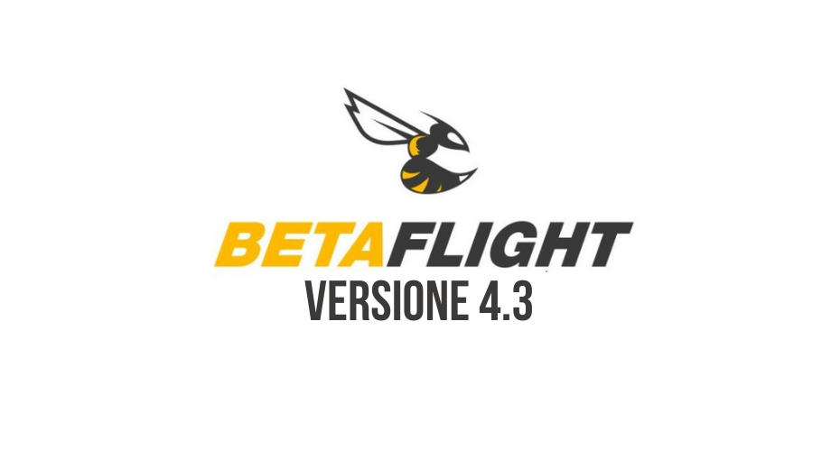

L'ultima iterazione di Betaflight, la versione 4.3 è pronta all'uscita e porta diversi miglioramenti.

## Introduzione

Quando Betaflight 4 è stato rilasciato, alcuni hanno affermato di preferire la versione precedente 3.5. Penso che il motivo potrebbe essere dovuto al passaggio da settings per il tuning che erano familiari e ad alte prestazioni sulla versione 3.5, che nella versione 4 sono diventate più conservative e più adatte a build da gara 6s piuttosto che 4s freestyle.

Se sei interassato a conoscere i segreti del PID tuning ti consiglio [questo articolo](https://lucafpv.com/come-tunare-pid). 

Betaflight può sembrare eccessivamente tecnico con la sua vasta gamma di parametri, quindi gli utenti fanno spesso affidamento su impostazioni predefinite o i settings scelti in versioni precendenti. 

Il motivo per cui penso che Betaflight 4.3 avrà un impatto così significativo si può riassumenre nei seguenti punti:

* Il sistema preimpostato sbloccherà prestazioni molto migliori per molte build man mano che la libreria di tuning viene creata e include anche aspetti relativi alla configurazione come preimpostazioni radio VTX e RC, riducendo la complessità della configurazione di cui le persone spesso si lamentano.
* Il nuovo sistema con gli slider renderà più semplice modificare i preset in base alla build specifica. I nuovi slider sono molto più utilizzabili e intuitivi di quelli originali.
* I miglioramenti delle prestazioni nel codice sono significativi, come tempi di loop più accurati, un migliore filtraggio e un'elaborazione dell'input RC più fluida. Tutto sommato, ottiene notevoli miglioramenti in quelle che considero le aree chiave per il freestyle: fluidità e prestazioni del propwash.

Tutti questi elementi sono stati attentamente controllati da un impressionante team di sviluppatori che contribuiscono al progetto gratuitamente e dedicano molto tempo e sforzi alla base del codice controllando attentamente il loro lavoro per garantire rilasci privi di bug e problemi minimi per l'utente finale.

Potremmo definire Betaflight 4.3 una piccola rivoluzione perché nonstante i cambiamenti siano pochi, la portata di questi aggiornamenti produrrà un effetto rivoluzionario sulla comunità FPV. È Betaflight che ora supporta e spedisce quasi tutti i produttori, e il sistema dei preset nel tempo rivoluzionerà il modo in cui le persone interagiscono con il firmware – da whoop a 10” – rendendolo molto più semplice.

Per gli appassionati di tuning ad alte prestazioni, i miglioramenti del codice saranno notevolmente più fluidi e funzioneranno meglio. Fondamentalmente, Betaflight 4.3 rilascerà tutto il potenziale del firmware Betaflight 4 che era già eccellente, ripulendo le prestazioni e l'usabilità.

## Importante

- Dopo l'aggiornamento a Betaflight 4.3, **DEVI utilizzare l'ultimo Betaflight Configurator**. Le versioni precedenti del configuratore 10.8 e 10.7 non funzioneranno correttamente con la versione 4.3.

- I processori F4 dovrebbero girare con PID loop a 4k. Gli utenti F411 devono utilizzare DShot300, non DShot600 e sono bloccati da un loop PID 8k. La maggior parte degli F411 dovrebbe essere overcloccata a 120 Mhz, anche se alcuni tollereranno solo 108 Mhz.

- **NON incollare diff o dumps fatti da versioni precedenti**. Questo è dovuto al fatto che sono state fatte delle modifiche ai parametri. Un preset adatto dovrebbe dare ottimi risultati.

- Gli utenti esperti che desiderano utilizzare l'immissione di dati numerici per l'ottimizzazione e i filtri DEVONO prima disabilitare i loro cursori. È più facile farlo nel Configuratore.

- Si consiglia di utilizzare il filtro basato su RPM per ottenere le migliori prestazioni. 

- L'utilizzo della CPU è ora riportato come un valore molto più alto rispetto a prima. Va bene, è solo una modifica al modo in cui lo mostriamo. Non preoccuparti finché non raggiunge il 75%.

## Tuning con gli slider

I nuovi slider PID supportano qualsiasi "metodo" di ottimizzazione. Ecco quindi un riassunto di come è possibile effettuare il tuning per Betaflight 4.3.

### Tuning "semplice
Il modo più rapido e semplice per tunare con i nuovi slider è spostare entrambi gli slider P e D insieme a destra finché non accade qualcosa di "brutto". Per questo suggerisco sempre di provare piccoli incrementi alla volta, e dopo ogni incremento effettuare un piccolo volo. Questo mantiene il rapporto P:D, approssimativamente. Fermati o tira leggermente indietro quando i motori si surriscaldano o senti dei rumori cattivi nelle curve ad alta velocità o durante l'armamento, questo è un segno che gli slider P e D sono troppo alti. Per un tuning semplice e veloce, è molto probabile che questo ti dia un risultato davvero buono.

Quindi regola il cursore Stick Response (feedforward) a tuo piacimento.

### Tuning "Prima la D".
Il metodo di tuning "Prima la D" prevede aumenti graduali della D, anche qui fino a quando non accade qualcosa di brutto, quindi diminuendo di uno o due step e non andando più in alto. Dopodiché, il processo viene ripetuto per P.

Questo si basa su due concetti fondamentali:

1. Più D puoi applicare, più P puoi usare;
2. Generalmente, un quad seguirà meglio con la P e D più alta che può tollerare.

Ecco i sintomi comuni di una D troppo alta:

* I motori si scaldano,
* Sentiamo suoni stridenti o ronzanti all'armamento
* Il quad vola via rumorosamente all'armamento

Il limite principale alla quantità di D che puoi eseguire è la pulizia della build. Motori costruiti con buoni cuscinetti, ben bilanciati e ben centrati, telai rigidi, eliche rigide, ecc. Droni con queste caratteristiche accetteranno più D. Eliche diverse o impostazioni ESC possono avere un'influenza.

Una volta che hai impostato D il più alto possibile, porta P fino a quando non succede qualcosa di brutto, ad esempio:

* Un suono svolazzante dall'oscillazione di P in giri di accelerazione medio-alti
* Sovraelongazioni o risonanze di breve durata
* Oscillazione P diretta.

Di solito la maggior parte dei quad finisce con P intorno al valore D, o un po' più alto.

### Tuning "classico"
In questo metodo, si spinge P verso l'alto, gradualmente, fino al suo limite, con il cursore D impostato un po' più in basso del solito per la build che si sta tunando (ad esempio, 2/3 di P). 

In genere ci fermiamo quando il quad inizia a "vacillare", "svolazzare" o "tremare" alla fine dei punch o dei roll, o durante le curve veloci e dure. Quindi riportiamo P fino a quando non c'è un accenno di quell'oscillazione e portiamo gradualmente D in alto, per gradi, per quanto possibile, ma di solito non più in alto di P, nel tentativo di bloccare quell'oscillazione residua. Potremmo essere limitati nella quantità di D che possiamo applicare, dal calore o dal rumore del motore. Se controlliamo l'oscillazione, a volte possiamo portare P un clic più in alto e aggiungere ancora uno o due clic di D per vedere se possiamo controllarlo.

L'obiettivo è ottenere entrambi i parametri il più in alto possibile senza i problemi indesiderati di sfarfallio, risonanza o calore eccessivo del motore.