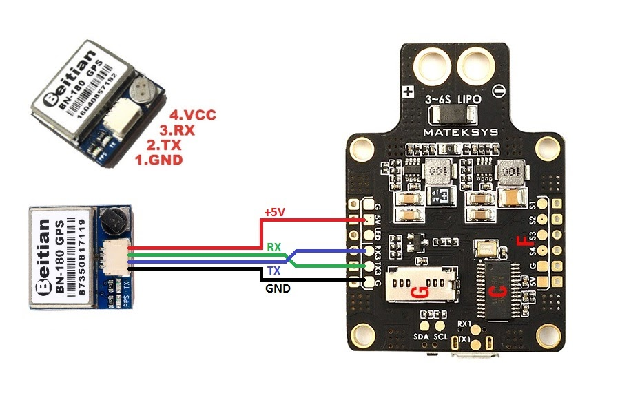
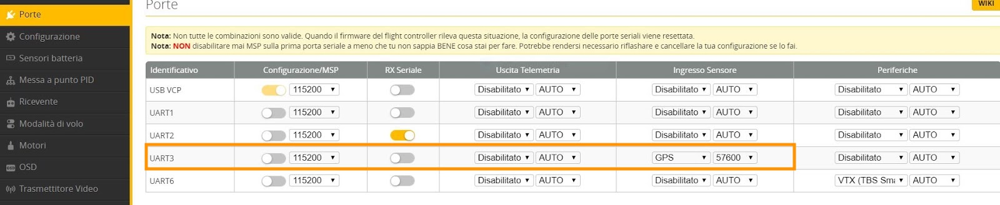
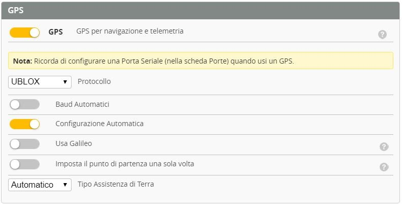
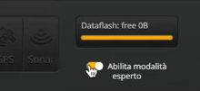

Come montare il modulo GPS sul tuo nuovo modello? In questa guida ti mostrerò come impostare e configurare il GPS su un **drone FPV** per volare senza più preoccuparti di un possibile failsafe.

## Perché usare un GPS su un drone FPV?
La risposta sembra banale, per evitare di perdere il nostro prezioso drone appena costruito. Giusto?

Si, ma non solo. Avere un modulo GPS sul drone ci permette di ottenere molte informazioni utili durante il volo. Tutte queste informazioni vengono mostrate sull'OSD. Se non sai come fare, leggi [come configurare l'osd](https://lucafpv.com/configurare-osd-betaflight).

Tra le informazioni utili troviamo l'indicazione di dove si trova il punto di partenza. Questo non è da sottovalutare, infatti se ci allontaniamo di diverse centinaia di metri, diventa molto facile perdere l'orientamento e non riuscire a tornare indietro.

Possiamo anche mostrare la latitudine e la longitudine, di modo da sapere in ogni momento la posizione esatta del drone. In questo modo, in caso di crash, riguardando il video registrato sul DVR degli occhiali, sarà possibile recuperare il modello.

## Dove montare il GPS? 

La posizione in cui si monta il modulo GPS è fondamentale per avere un buon segnale. I posti migliori sono lontano dagli altri compoenti elettronici per evitare interferenze. Si cerca di sempre di metterlo più in alto possibile. 

Io sui miei droni, spesso stampo in 3D un supporto che monto a seconda del frame. Ultimamente sto trovando molto comodo montare il GPS sopra lo strap della batteria, tramite questo [supporto in 3D](https://www.thingiverse.com/thing:3217191). 

Questa soluzione ha degli ottimi vantaggi. Il modulo si trova nel punto più alto e lontano dal resto dell'elettronica. La sua semplicità di montaggio però, è anche il suo svantaggio, perché in un eventuale crash é facile che si stacchi.

Ad ogni modo, altri posti comuni in cui montarlo sono sopra il mount della GoPro, oppure sopra un bracetto. 

## Collegamento GPS e FC

Il modulo GPS, più comune usato nei droni FPV è il Beitian BN-220 (Acquistalo su [Amazon](https://amzn.to/2WoRamu) o [Banggood](https://www.banggood.com/custlink/mKmd4V9K5P)). Questo modulo ha uno spinotto con 4 fili colorati.  
Il connettore può entrare in un solo modo quindi li non si può sbagliare. Ora per collegarlo al flight controller, basta collegare il filo che si trovo più vicino alla piccola batteria (il filo rosso), ad un pad 5V dell'FC. Il filo nero va collegato ad un pad GND. 

Per quanto riguarda TX e RX, come per tutti i dispositivi seriali, il filo TX (quello dopo il nero), va collegato ad un pad RX sul flight controller. Mentre il filo RX del GPS va collegato ad un pad TX sul flight controller.

### Quali TX e RX uso sul flight controller?

Dipende da te. Scegli i pad che sono più comodi su cui saldare. 
> Devi solo fare attenzione che la UART corrispondente non sia già in uso

Ad esempio, se ho liberi i pad TX2 e RX2, che corrispondono alla UART2, e non li sto usando per nessun altro dispositivo, allora posso tranquillamente usarli per il GPS. 

E' importante che si utilizzi la coppia, ovvero se scelgo TX2, devo usare per forza RX2 e non posso usare RX1 o RX3. 

## Configurazione su Betaflight

La prima cosa da fare è abilitare come sensore di ingresso il GPS nella sezione Porte. Qui bisogna far attenzione ad attivarlo nella riga corrispondente alla UART sulla quale si è collegato il GPS (come spiegato nella sezione precendete). Come baudrate, va bene sia AUTO che 57600. 

Una volta fatto questo cliccare il tasto giallo in basso a destra per salvare.

Quindi ora dobbiamo attivare le funzionalità del GPS andando nella sezione Configurazione e in basso a destra troveremo le impostazioni relative al GPS.

Una volta fatto questo cliccare il tasto giallo in basso a destra per salvare.

A questo punto, per procedere, bisogna attivare la modalità esperto. In questo modo avremo la possibilità di cambiare il comportamento del drone in caso di failsafe.

A questo punto, nella colonna di sinistra, saranno presenti nuovi voci di menú. Apriamo quindi la sezione Failsafe. In questa tab potremo specificare il comportamento del drone in caso di perdita di segnale. Il comportamento di default è Drop, ovvero il drone si disarma e cade. Ma se abbiamo il modulo GPS, possiamo scegliere di usare GPS Rescue, ovvero una sorta di Return to Home.

I consiglio sempre di lasciare i settings di default, per esser sicuri. In ogni caso, lascio di seguito la spiegazione dei vari parametri.

**Angle**: l'inclinazione massima che il drone può raggiungere. In situazioni di vento il modello avrà bisogno di una maggior inclinazione per poter procedere in avanti e fronteggiare la spinta dell’aria; generalmente 30/35 gradi son più che sufficienti.

**Altitudine iniziale**: l’altezza che verrà raggiungerà prima di tornare verso il punto di partenza. Tuttavia, in caso durante il volo abbia si sia raggiunta una altitudine maggiore di questo valore, allora in caso l'altezza raggiunta sarà l'altezza massima + 15m. 

**Distanza di discesa**: la distanza dal punto di partenza dalla quale iniziare la discesa verso terra.

**Velocità al suolo**: la velocità alla quale il drone teneterà di tornare al punto di partenza. Ricordiamoci che è espressa in metri al secondo e non è bene esagerare; 10/15 metri al secondo sono più che sufficienti.

**Gas minimo/ massimo/ hovering**: i valori del gas che verranno usati per far tornare il drone al punto di partenza.

**Velocità di ascesa/ discesa**: entrambe sono velocità espresse in metri al secondo della salita automatica all’altitudine iniziale ed alla discesa verso terra.

**Satelliti minimi**: i satelliti minimi che il GPS dovrà agganciare prima di farci armare il drone. Il tempo impiegato a trovare i satelliti minimi può variare e solitamente è di qualche minuto. Un numero maggiore di satelliti permetterà una migliore precisione della modalità rescue. Il numero minimo è 5, sotto questo valore il nostro drone non potrà svolgere la funzione di return to home.

**Modalità altitudine**: solitamente viene impostata come “altitudine massima”.

**Controlli di salute**: è importante impostare questo valore come “solo failsafe”. I controlli di salute sono i controlli che il FC esegue prima di attivare la modalità rescue:

- Il GPS è attivo
- Il GPS è agganciato a un numero corretto di satelliti
- Il drone si muove liberamente senza nessun ostacolo
Se uno di questi dati rilevati dalla FC non è corretto, il drone si disarmerà e cadrà.

Se attiveremo “consenti l’armamento senza fix” il drone si armerà e potrà volare senza aver agganciato il numero minimo di satelliti, ma è bene ricordare che la funzione rescue non sarà disponibile, anche se durante il volo viene raggiunto il numero di satelliti minimo.

## Come attivare la modalità rescue (RTH)

Oltre all'attivazione automatica, in caso di failsafe, la modalità GPS rescue può essere attivata anche manualmente. Infatti oltre che per ragioni di test, attivare la funzione di return to home manualmente, può tornare utile nel momento in cui si perde il segnale video ma si è ancora collegati tramite il segnale radio.

Configurare il RTH (return to home) su uno switch è semplice, si procede come per [configurare le altre modalità di volo](https://lucafpv.com/modalita-di-volo-betaflight/). 