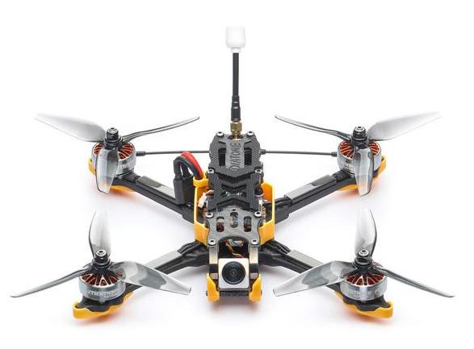
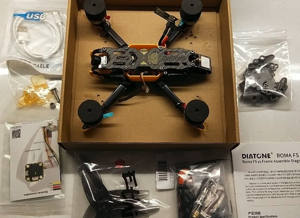
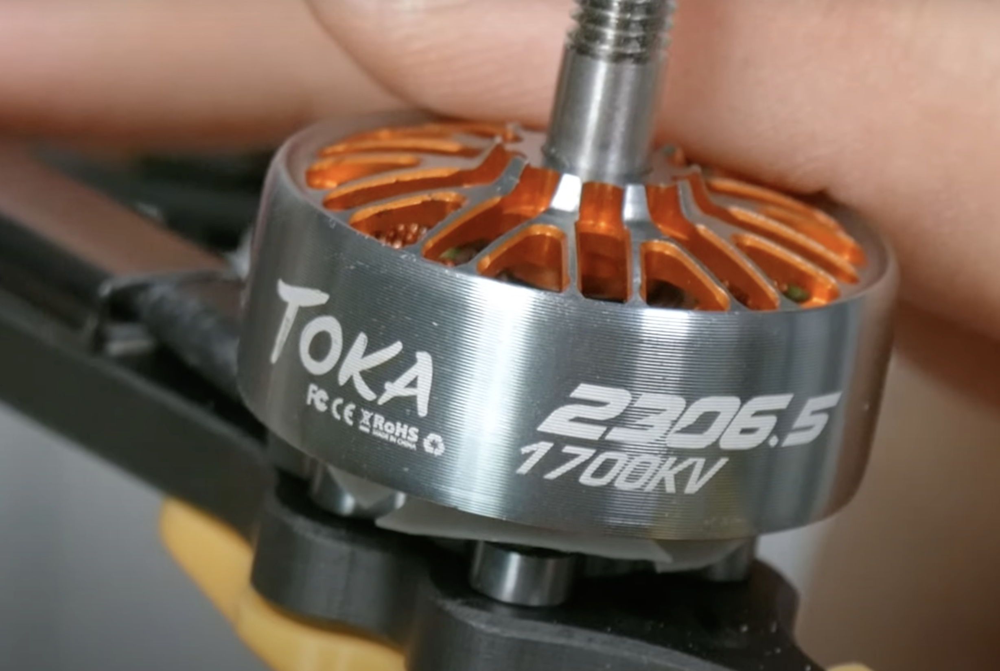

Il Diatone Roma F5 V2 è un drone FPV per principianti a 300 euro. In questa fascia di prezzo troviamo i droni economici, ma di qualità. Questa è la versione 6S ([tutto quello che devi sapere sulle batterie](https://lucafpv.com/batterie-dei-droni)) ed è PNP, il che significa che viene spedito senza ricevente. Il pilota dovrà inserire la propria ricevente compatibile col il suo radiocomando.

## Cosa c'è nella scatola?

Nella scatola troviamo ovviamente il drone, già assemblato. Un set di 4 eliche di HQ Props, in particolare quelle nella confezione sono le S5. Diatone fornisce anche un beeper per facilitare la ricerca del drone in caso di crash.

Ci sono anche 2 cinturini per attaccare la batteria. Io consiglio sempre di utilizzarne due insieme, sembra che offrano più stabilità, riducendo la possibilità che la batteria si stacchi durante uno schianto.

Infine ci viene fornito un supporto universale per la GoPro, documentazione su come configurare il drone e delle viti di scorta.

## Diatone
Diatone è una marca conosciuta da diversi anni nel mondo FPV. Famosi per i loro stack Mamba e il cinewhoop Taycan.

Diatone questa volta mi ha stupito in modo positivo. La documentazione è eccellente, hanno addirittura preso ispirazione da DJI e inserito sui motori degli sticker per indicare in che verso girano in motori. 

Questo per un principiante è fondamentale in quanto rende più semplice il montaggio delle eliche (perché le eliche hanno un senso e non possono essere montate a caso). 

## Peso
Per quanto riguarda il peso, la nuova versione ha 30 grammi in più. Questo lo si può spiegare col fatto che Diatone afferma di aver aumentato anche la resistenza del frame. Oltre questo la v2 ha la vtx con un dissipatore, il gps con il tpu e le viti aggiornate. Dalle prove fatte, questi 30 grammi si sentono, ma non incidono sul tempo di volo.

## Motori
La nuova versione aggiorna anche i motori. Ora vengono montati dei 2306.5 al posto dei 2207.5 sulla v1. Abbastanza simili in dimensioni e peso. 

Mi piace la cura dei dettagli in questo drone, il tema arancione si trova anche nei motori.

## Video e VTX
La v2 aggiorna anche la VTX che era forse il punto debole della v1. Infatti in precedenza la vtx arriva fino a 400mW, rendendo difficile il suo utilizzo per il freestyle nei bandi. Con questo aggiornamento troviamo una vtx capace di arrivare fino ad 1W, togliendo tutte le preccupazioni di perdere il segnale video.

## Frame
Le differenze per quanto riguarda il frame tra le due versioni sono tutte pensate per aumentare la resistenza del telaio. Infatti, il principale dubbio sulla v1 era la resistenza ai crash. Nella v2 troviamo bracetti più larghi e le viti aggiornate sulla parte anteriore del frame. 

## Chi lo dovrebbe comprare?
Il Diatone Roma F5 V2 è pensato per i pricipianti, le persone che vogliono un vero drone FPV con ottimi componenti e istruzioni chiare. Questo drone si colloca nella fascia economica, ed è uno dei migliori droni FPV per pricipianti nel 2022.

Rispetto al iFlight Nazgul 5, altra classica scelta per i principianti, il Diatone Roma F5 V2 offre di più in rapporto qualità prezzo. 