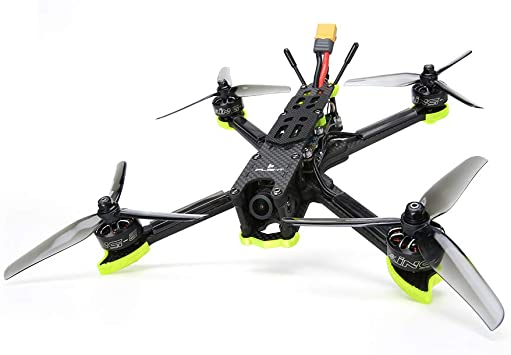
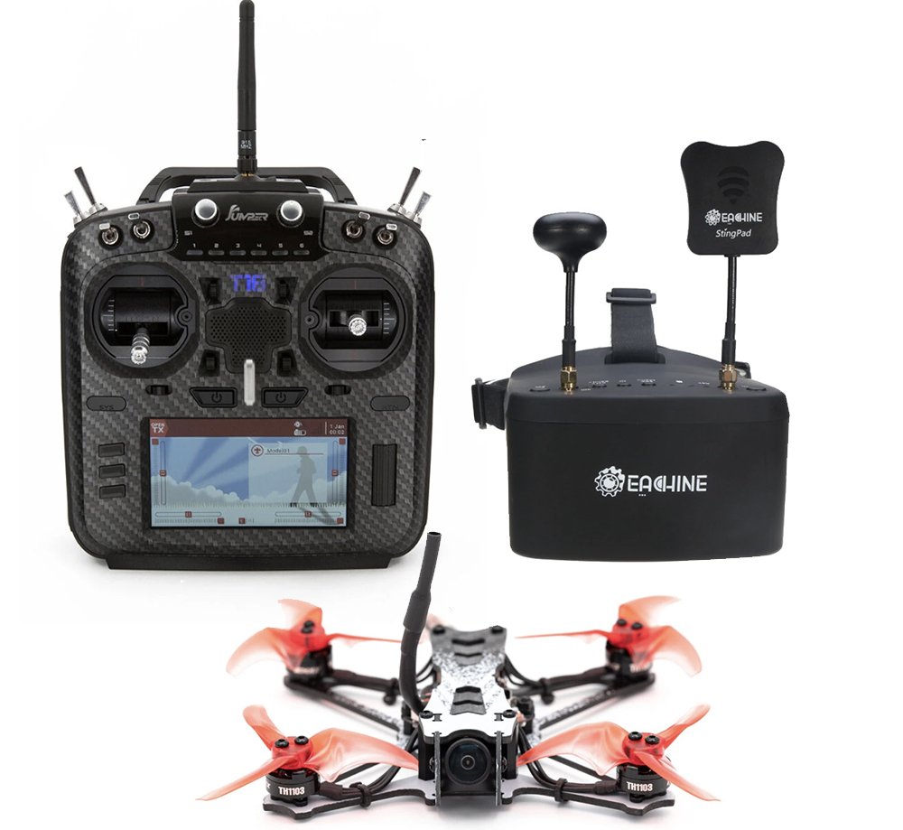

Stai cercando il miglior drone FPV per iniziare a volare nel 2022? Questa guida è quello che cerchi, ti mostrerò quali sono le alternative, spiegherò i pro e i contro dei diversi droni, considerando anche le varie fasce di prezzo.

Quando scegli il tuo primo drone FPV per iniziare, oltre a fare attenzione al prezzo del drone stesso, devi controllare cosa c'è nella scatola. 

Infatti, una cosa che lascia stupita molte persone che iniziano, è che quando compri un drone FPV, riceverai solo il drone. Niente batterie, niente radiocomando, e niente occhiali. In pratica un pezzo di carbonio con dell'elettronica che non potrai usare.

Quindi tieni a mente questo quando scegli il tuo drone.

## 1. DJI FPV Drone Combo

Scelta molto controversa per i puristi dell'FPV, ma personalmente trovo che per una persona che stia entrando nel mondo dei droni FPV, questo drone è la scelta perfetta. 

A primo impatto il costo di circa 1300 euro può spaventare. Ma all'interno della confezione ci sono molte cose.
Prima di tutto, oltre il drone riceviamo il visore (DJI Goggles), che se acquistati separatamente costano circa 600 euro. Poi abbiamo anche il radiocomando e una batteria. Quindi acquistando questo kit, siamo già pronti per volare, senza dover comprare ulteriori accessori.

### Chi lo dovrebbe comprare?

Il DJI FPV Drone è perfetto per chiunque abbia già volato con un drone DJI, ma voglia provare a volare in modalità FPV con un drone capace di arrivare anche a 140 km/h. Questo kit è ideale anche per tutti coloro che non vogliono spendere troppo tempo a capire come installare e configuare il proprio drone.

> Acquista il DJI FPV Drone combo su [Amazon](https://amzn.to/3ksZQAD)

Spesso lo paragono ad un iPhone, bello e semplice da usare ma con pochissima personalizzazione. Se invece preferisci avere piú possibilità di smanettare allora continua a leggere.

## 2. iFlight Nazgul5 V2

Questo è un vero e proprio drone FPV. Veloce e resistente, regge tranquillamente il peso di una GoPro, ed è esteticamente bello. A livello di prezzo siamo intorno ai 250 euro. Ma per questo prezzo riceveremo solo il drone. Niente visore, niente radiocomando e niente batterie.

Di questo drone online ci sono diverse versioni, io consiglio sempre la versione 6S, anche per i principianti. In questo modo spendarai meno soldi nel tempo. 

### Chi lo dovrebbe comprare?

L'iFlight Nazgul5 V2 è perfetto per coloro che sono seriamente intenzionati ad entrare nel mondo FPV, per passione o per lavoro ([come guadangare con un drone](https://lucafpv.com/come-fare-soldi-con-un-drone)). Ideale per chiunque non ha paura di imparare cose nuove.

> Acquista l'iFlight Nazgul5 V2 su [Amazon](https://amzn.to/3zqBqOc) | [Drone24Hours](https://www.drone24hours.com/prodotto/nazgul5-v2-4s-6s-bnf/?D24H=lucapalonca) | [Banggood](https://www.banggood.com/custlink/DmmE4FSA7g)

<!-- Potrebbe interessarti anche: [cose da sapere prima di comprare un drone FPV]() -->

## 3. GEPRC CineLog35

Un drone veloce e compatto. Costruito in fibra di carbonio incredibilmente resistente, le eliche da 3,5 pollici sono protette da plastica, ideale per il volo all'interno. Queste sue caratteristiche lo rendono perfetto per chi vuole usare un drone FPV per fare riprese cinematic come queste. 

<lite-youtube videoid="dt3F3pEdACE" params="start=10"/>

Video come questi sono possibili grazie alla potenza dei motori del nuovo CineLog35, che gli permettono di sollevare anche il peso di una GoPro Hero 10.
<!-- Vuoi sapere come fare video come questo? Magari potrebbe interessarti [come fare video cinematic]() -->
Se vuoi saperne di più su questo drone leggi [questo articolo](https://lucafpv.com/nuovo-cinelog35).

### Chi lo dovrebbe comprare?

Chi vuole usare questo drone per realizzare video cinematic all'aperto e all'interno. Che ha la necessità di montare una GoPro sul drone per i video in alta qualità. 

> Acquista GEPRC CineLog35 su [Drone24Hours](https://www.drone24hours.com/product/geprc-cinelog35-hd/?lang=en&D24H=lucapalonca)

## 4. Kit EMAX Tinyhawk II

Se vuoi partire subito kit EMAX Tinyhawk II è quello che ti serve. All'interno di questo kit hai tutto ciò che ti serve per volare in FPV. Il kit comprende il drone, che è ideale per chi inizia date le sue dimensioni. Un ottimo radiocomando, che può esser sfurttato anche per altri droni successivamente. Un visore di bassa fascia, che è ideale per tenere i costi contenuti. Un paio di batterie e il caricabatterie. 

A differenza delle opzioni precedenti, questo kit, per meno di 500 euro offre tutto quello che serve. 

### Chi lo dovrebbe comprare?

Questo kit è ideale per chiunque voglia l'ebrezza di un drone FPV e non è interessato inizialmente a montare una GoPro per registrare video. E' pensato soprattutto per chi non vuole passare troppo tempo a scegliere diversi prodotti e cercare di capire se sono compatibili l'uno con l'altro.

> Acquista il Kit EMAX Tinyhawk II su [Drone24Hours](https://www.drone24hours.com/prodotto/emax-tinyhawk-ii-freestyle-rtf/?D24H=lucapalonca)

## 5. Drone FPV autocostruito

Parte integrante del mondo FPV è costruire e riparare i propri droni, quindi perché non partire subito fin da subito. Costruirlo da zero non molto complicato. La parte fondamentale è la scelta dei componenti, scegliere i pezzi compatibili tra loro.

Io personalmente ho iniziato cosi, e trovo che costruirsi il proprio drone sia un processo dal quale si impara molto. Per non parlare poi delle emozioni che si provano nella prima build. 

Se vuoi costruirlo anche tu, ti consiglio di seguire questa guida su [come costruire il tuo primo drone FPV](https://lucafpv.com/come-costruire-un-drone-fpv)

### Chi lo dovrebbe comprare?

Chiunque non abbia paura di sporcarsi le mani nell'assemblare, installare e configurare. Chi vuole vivere l'esperienza FPV dall'inizio alla fine. C'è da tenere conto che ci sarà parecchio da imparare, ma la fatica sarà ripagata. Inevitabilmente, prima o poi si romperà qualcosa sul drone, e se avete lo avete assemblato voi, allora risulterà più semplice ripararlo.
