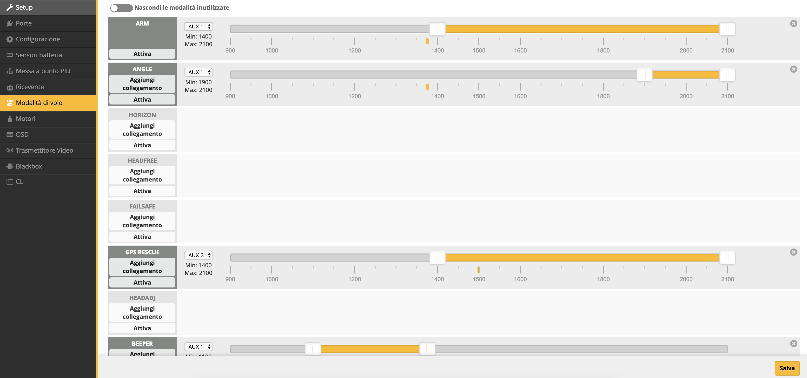
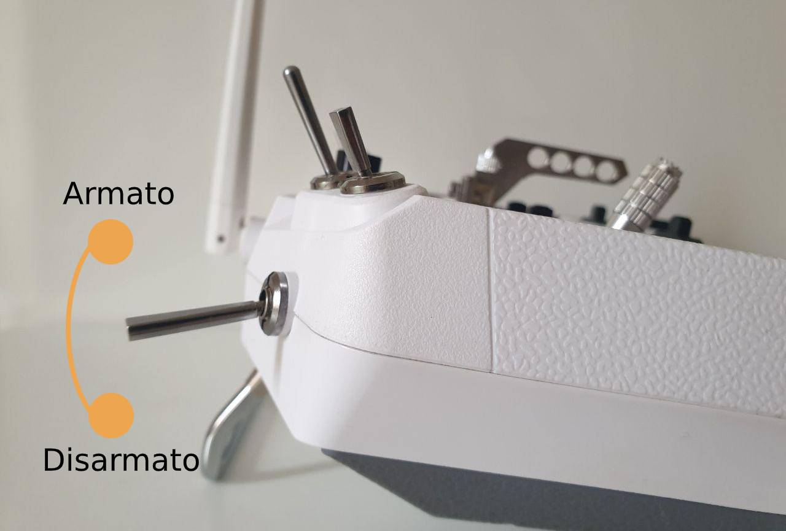
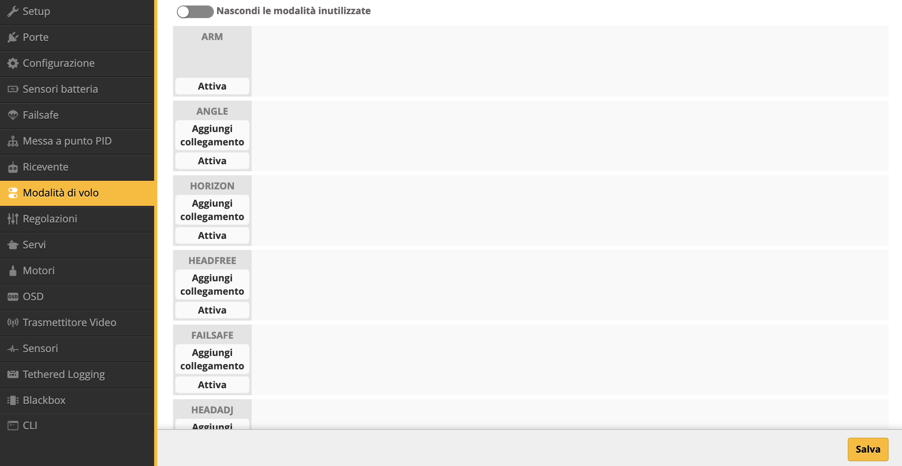
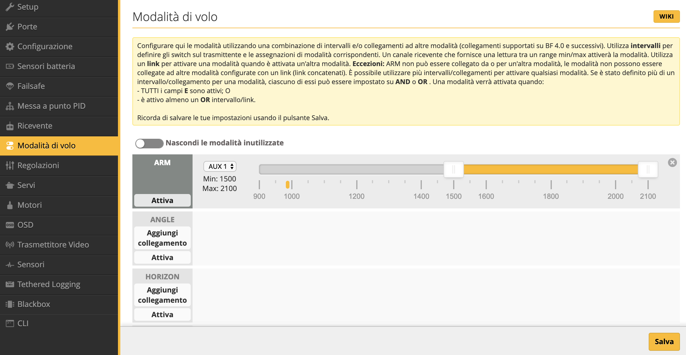
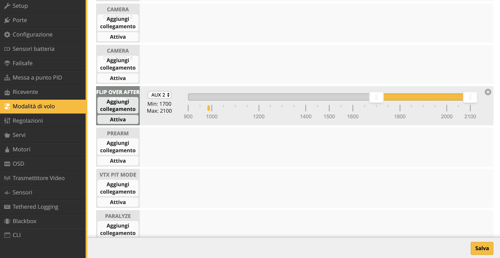
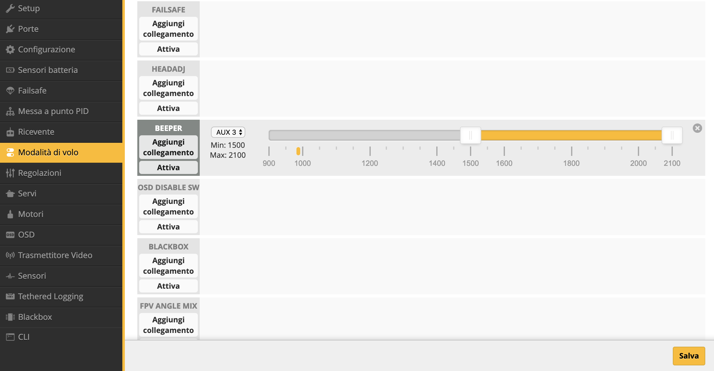

In questo tutorial spiego le diverse modalità di volo disponibili in Betaflight e come configurarle in Betaflight Configurator. Il procedimento è simile per qualsiasi quadricottero, flight controller e radiocomando tu stia usando.

Se è la prima volta che usi Betaflight, potrebbe anche interessarti [come configurare Betaflight per il primo volo](https://lucafpv.con/configurare-betaflight/).

Non tutte le "modalità" che sono presenti nella sezione Modalità di volo in [Betaflight Configurator](https://lucafpv.com/scaricare-betaflight-configurator/), sono vere e proprie modalità. Alcune di queste sono delle funzionalità. 

## Arm

Per decollare, il quadricottero deve prima essere armato. Una volta armato, i motori cominceranno a girare. Ma se hai l'opzione “MOTOR STOP” disabilitata, allora i motori non girearanno finché non darai gas. 

Puoi assegnare uno switch del tuo radiocomando in modo tale che cambiando lo stato dell'interruttore il quad si armi e disarmi. 

<!-- If you have trouble arming, there can be many potential causes. In this article I will help you [troubleshoot why you can’t arm a quadcopter](https://oscarliang.com/quad-arming-issue-fix/). -->

## Angle, Horizon & Acro Mode

Sia con la modalità Angle che Horizon, il quad utilizzerà l'acceleromentro e giroscopio per auto livellarsi. Queste due modalità sono le più facili da imparare per un principiante. 

Puoi comunque fare flip e roll in modalità Horizon ma non in modalità Angle perchè in questa modalità viene limitata l'inclinazione massima a 45 gradi (che è comunque modificabile). Questa è la vera e unica differenza di queste due modalità. 

Ad ogni modo, la modalità Acro è la "vera" modalità in cui volare sia per freestyle che racing. Anche se più difficile da imparare, consiglio fortemente di imparare a volare in Acro. 

<!-- I have an article discussing [why you should be learning Acro mode](https://oscarliang.com/rate-acro-horizon-flight-mode-level/). -->

> **Dove si trova la modalità Acro?**
>
> Noterai che la modalità Acro non è disponibile nella sezione modalità di volo. Questo perchè è la modalità di default, e nel momento in cui armi il tuo quad sarà automaticamente in Acro. 
>
> **Come mai non vedo Angle e Horizon?**
>
> Se non trovi le modalità Angle e Horizon nella sezione modalità di volo, significa che il tuo accelerometro è disabilitato. Alcuni preferiscono disabilitarlo quando volano in Acro per avere più potenza di calcolo a disposizione. Per abilitare/disabilitare l'accelerometro trovi una checkbox nella sezione Configurazione.

## Beeper

La "modalità" Beeper, in realtà è una funzionalità che permette, tramite uno switch sul tuo radiocomando, di attivare il buzzer (cicalino) sul drone (se ne hai uno). Questo permette di ritrovare facilmente il drone nel caso in cui sia caduto magari in un campo con l'erba alta. Potrebbe essere anche utilie configurare l'ESC beacon in modo che i tuoi motori suoneranno insieme al tuo beeper. E' sempre utile avere un backup. 

## Airmode

Anche Airmode è una funzionalità di Betaflight. In breve, permette di controllare meglio il modello in aria quando hai il gas a zero. Questo è particolarmente utile se fai freestyle, infatti io preferisco averla sempre attiva.

Fai attenzione che con Airmode attiva, nel momento in cui cerchi di atterrare e tocchi il suolo, riprenderanno a girare in modo inaspettato. Per atterrare con questa funzionalità attiva, avvicinati il più vicino possibile a terra e poco prima di toccare il suolo disarma il quad. 

Nella sezione Configurazione hai la possibilità di tenere sempre attiva questa funzionalità, in questo caso non troverai Airmode nella sezione Modalità di volo. 

## Anti-Gravity

Un'altra funzionalità è Anti-Gravity. Riduce l'effetto picchiata (il naso del quad che punta in basso) quando cambi rapidamente il gas. Per farlo, in pratica aumenta momenteamente il termine I quando il valore del gas cambia molto.

<!-- See this article to learn more about [how PID can affect flight performance](https://oscarliang.com/quadcopter-pid-explained-tuning/). -->

Come per Airmode, se hai abilitato questa funzionalità nella sezione configurazione, non la troverai nella sezione Modalità di volo.

## Blackbox Start/Erase

Permette di cominciare a registrare informazioni di volo su file. 

## OSD Disable SW

Disabilità l'OSD, quindi rimuove il testo dal tuo video FPV.

## Prearm

Utilizzando sono uno switch per armare il quad, potresti armare il quad per sbaglio e quindi può essere pericoloso. Con la modalità Prearm aggiungi un livello ulteriore livello di sicurezza.

Puoi impostare questa funzionalità ad uno switch e il quad si armerà solo se lo switch è attivato. Dopo aver armato, la modalità prearm può essere disabilitata. Quindi uno swtich momentano è perfetto per questo. 

## Flip Over After Crash

Una delle modalità più utili, in mia opinione. Quando crashi il quad e finisci con il quad "a testa in giù", utilizzando questa modalità potrai provare a girare il quad, senza doverlo andare a recuperare. In pratica, quello che fa è girare i motori nel verso opposto, e per funzionare devi utilizzare degli ESC che supportano il protocollo DShot. 

Questa modalità è spesso chiamata anche “Turtle Mode”. <!-- Tutorial come configurare Turtle Mode -->

## VTX Pit Mode

Permette di attivare lla modalità Pit mode sulla tua VTX se la supporta SmartAudio oppure Tramp Telemetry. Attivare Pit mode signifca sostazialmente impostare la potenza di trasmissione della VTX quasi a 0. Se gareggi può esser utile, così nel momento in cui crashi non interferisci con il video degli altri. 

## Failsafe

Attiva la procedura di failsafe manualmente, per simulare una perdita di sengale. Utile quando devi testare la tua procedura di failsafe.

## Paralyze

Pensato per il racing. Quando viene attivato spegne la VTX e la ricevente per evitare di causare interferenze con gli altri piloti. Può essere resattata solo rimuovendo la batteria. 

## Acro Trainer

Pensato principalmente per principianti, permette di volare in Acro con un limite sull'angolo di inclinazione.

## Configurare le modalità

Le modalità di volo in Betaflight possono essere attivate tramite gli switch del radiocomando. <!-- Come scegliere il radiocomando --> 

<!-- Guida su come impostare switch in OpenTX -->

Per semplicità, configuro tre modalità su tre switch diversi. A ogni switch, tipicamente è associato un canale ausiliare indicato con AUX. Il primo canale ausiliare AUX 1, corrisponde al canale 5; AUX 2 al canale 6 e cosi via. 

In questo esempio, lo switch SF della mia radio invia segnali sul canale 5 e quindi corrisponde ad AUX 1. In questo modo, nel configurare le modalità di volo, so già a quale AUX assegnare la funzionalità che mi interessa.  

Impostare gli switch è forse la parte più complicata di questo processo. Ora viene la parte più semplice.

Vai nella sezione Modalità di volo su Betaflight Configurator.

Per configurare le modalità, è meglio avere il radiocomando acceso e collegato con il modello che stai configurando.

Cominciamo dalla più importate, ARM. Clicca "Attiva" e seleziona l'AUX associato allo switch che vuoi utilizzare. Nel mio caso AUX 1.

Ora devi scegliere in quale range di valori vuoi che venga attivata questà modalità. Per uno switch a due posizioni, puoi tranquillamente impostarlo da 1500 a 2000, come in questo caso. 

Per la turtle mode, uso uno switch a tre posizioni, quindi il range in cui voglio questa funzione attiva sarà dopo 1600 e 2000.

Per attivare il beeper del quad, utilizzo lo switch momenteno configurato su AUX 3.

## Hai bisogno di una mano?

Se hai domande oppure non riesci a configurare qualcosa, [scrivimi](https://lucafpv.com/contattami) e unisciti ai gruppi Telegram: [Droni Racers Italia](https://t.me/droniracersitalia) e [Milano Droni RC FPV](https://t.me/MilanoDroniRC).

