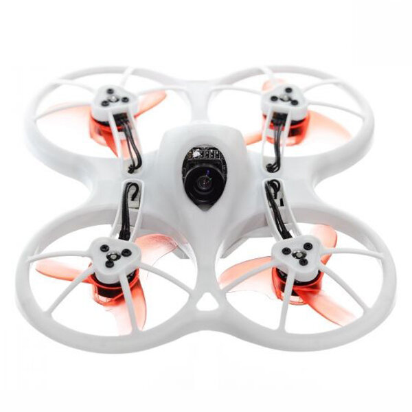

import AffiliateLink from "../../components/blog/affiliate-link.js"

Quanto costa comprare un drone nel 2021? 
> **La risposta breve è dipende**, infatti esistono diversi tipi droni, ognuno dei quali ha una fascia di prezzo diversa. 

Quindi vediamo il prezzo dei droni suddiviso per le diverse categorie, dalla più economica alla più costosa.

|   	                                                                                                                  | Categoria 	                                    | Prezzo 	            | Utilizzo                                          |
|---	                                                                                                                  |--------------	                                |----------------       |------------------------------------------------   |
|     | <a href="#toy">Droni giocattolo</a>             | da 20 a 200 euro      | Imparare a volare senza telecamera                |
|       | <a href="#micro-fpv">Micro droni FPV</a>        | da 50 a 200 euro      | Gare al chiuso  FPV cinematic                 |
|     | <a href="#fpv">Droni FPV economici</a>          | da 100 a 200 euro     | Imparare a volare con telecamera                  |
| | <a href="#fpv-pro">Droni FPV professionali</a>  | da 300 a 600 euro     | FPV cinematic  Gare FPV  Freestyle        |
|      | <a href="#fotografia">Droni da fotografia</a>   | a partire da 500 euro | Foto aeree  Video making  Cinema          |

## Droni giocattolo

I droni giocattolo sono forse i più comuni nel mercato. Possono costare anche solo 20 euro, e ti forniscono tutto il necessario per poter volare. Tipicamente sono piccoli, non più grandi del palmo d'una mano. Sono molto leggeri e abbastanza resistenti agli impatti. Tuttavia sono solitamente lenti e poco potenti rispetto al resto dei droni presenti in questa lista. Spesso ci riferisce a questi dorni anche come micro brushed, perché montano motori a spazzole. 

### Riassunto

* Prezzo: da 20 a 200 euro
* Peso: meno di 50 g
* Dimensione del palmo di una mano
* Ideali per volare al chiuso
* Perfetti per principianti

---

## Micro droni

Sono perfetti per un principiante che vuole imparare a controllare un drone utilizzando un radiocomando. Ci sono centinaia di tipi di droni giocattoli di marchi come Hubsan, Eachine, Syma e Cheerson.

Alcuni di questi droni possono avere anche una telecamera di bassa qualità, la poca risoluzione della telecamera rende difficile, o quasi impossibile fare video o fotografie, e tipicamente non possono essere usate per trasmettere video in tempo reale (FPV). In generale, è difficile che droni sotto i 200 euro abbiano telecamere decenti.

### Esempi

* <AffiliateLink href="https://www.banggood.com/custlink/33vYc11JIc" label="Eachine E010"/>
* <AffiliateLink href="https://www.banggood.com/custlink/DmmYJwTc8j" label="Hubsan X4"/>

L'Hubsan X4 è uscito qualche anno fa, e rimane uno dei migliori micro brushed per principianti.

Questi sono diventati i micro quadricotteri più usati nell’hobby, sia per principianti che per esperti. Sono di piccole dimensioni e le eliche sono ben protette, minimizzando il rischio di causare danni e rovinare le eliche. Sono molto usati grazie alla possibilità di poter migliorare le parti, aggiungendo anche sistemi FPV.

---

## Micro droni FPV

Questi micro droni dotati di equipaggiamento FPV, quindi sono più sofisiticati della precedente categoria. A bordo hanno installato riceventi comuni, che sono compatibili con la maggior parte dei radiocomandi che è possibile utilizzare anche per altre categorie di quadricotteri.
> [Come scegliere il radiocomando ideale](https://lucafpv.com/migliori-radiocomandi-per-droni-fpv)

Inoltre il segnale video viene trasmesso a 5.8 GHz che è la frequenza standard di tutti gli occhiali FPV. 

**Suggerimenti**
* <AffiliateLink href="https://amzn.to/2SbtgFv" label="BetaFPV 65s"/>

---

## Droni FPV economici

Puoi costruire il tuo quadricottero e configurare da solo il tuo sistema FPV, ma se non hai la conoscenza necessaria in elettronica, ci sono anche delle soluzioni economiche. i cosiddetti droni FPV “plug and play”. Un esempio potrebbe essere l'<AffiliateLink href="https://amzn.to/34a8Pyv" label="Emax TinyHawk 2"/> - leggi la [recensione](https://lucafpv.com/emax-tinyhawk).

Questo è un sistema FPV completo, nel kit è incluso il radiocomando e un ricevitore video che permette di vedere in tempo reale il segnale video. È un modo relativamente economico per entrare nel mondo FPV e cominciare a volare, inoltre è ottimo per principianti.

---

## Droni FPV professionali

Conosciuti anche come mini quad, questi droni sono progettati per essere veloci, controllabili e resistenti. Hanno una diagonale tra i 200 e 250 mm e riescono a raggiungere tranquillamente 200 km/h. A differenza di semplici quadricotteri giocattolo, la costruzione di un mini quad può essere più complessa. I droni da gara sono equipaggiati con una telecamera che permette al pilota di vedere - in prima persona (FPV) - ciò che vede il drone

Recentemente anche filmmakers, content creator e fotografi stanno scegliendo questa categoria di droni. Infatti avendo un drone di questo tipo dà molta più flessibilità al pilota e permette di riprendere video che sono semplicemente impossibili con altre categorie di quadricotteri.

> Per avere un'idea di che tipo di video è possibile fare, dai un'occhiata al [mio profilo Instagram](https://www.instagram.com/iamlucafpv/)

### Riassunto 

* Prezzo: da 300 euro in su
* Peso: da 400 g a 700 g 
* Dimensioni: da 200 mm a 250 mm
* Ideali per freestyle, racing e riprese cinematic
* Perfetti sia per principianti che per esperti

### Costruzioni Fai Da Te

La maggior parte dei droni di questa categoria sono costruiti dai piloti stessi. Per le persone che non conoscono bene l’elettronica c’è molto da imparare, ma il bello sta anche nel costruirsi il proprio modello, oltre che a farlo volare. Puoi scegliere i componenti che vuoi, installarli e poi configurare il software necessario e poi finalmente volare. 

> Se vuoi avere un drone assemblato, ma non sai come fare [contattami](https://lucafpv.com/contattami)

### Ready To Fly

Se non ti piace l’idea di costruirti il tuo drone e vuoi volare immediatamente, puoi optare per i kit Ready To Fly. Quando acquisti un kit del genere il quad arriva già montato, non ti resta che connetterlo al tuo radiocomando e farlo volare. In questo modo salti completamente la fase di costruzione. 

### Scelte più comuni

* <AffiliateLink href="https://www.banggood.com/custlink/vDKEW1wrsV" label="iFlight Nazgul5"/> - leggi la [recensione](https://lucafpv.com/iflight-nazgul5)
* <AffiliateLink href="https://amzn.to/3zdqCTA" label="DJI FPV"/>

### Dimensioni dei Quad

I droni da gara sono divisi in categorie, queste dimensioni, classificano i quadricotteri secondo la dimensione delle eliche che montano. 

**In breve**: la categoria dei 5” (5 pollici) è la più comune sia per principianti che per piloti professionisti. Sono relativamente facili da costruire e hanno abbastanza potenza per sollevare l’intero quad, con anche una action camera. Inoltre, i componenti per questa categoria sono molto comuni e relativamente economici rispetto alle altre categorie.

2″, 3″ e 4″ – I quad appartenenti a questa categoria sono molto piccoli, e spesso adatti per volare al chiuso. Alcuni possono volare all’esterno, solo se il vento è assente. Sono perfetti per volare in spazi stretti oppure al parco, senza fare troppo rumore. 

5″ e 6″ – Sono la dimensione più comune sia per le corse che per il freestyle. Sono la categoria più versatile grazie al fatto che i droni di queste dimensioni hanno molta potenza e ma rimangono comunque facili da pilotare, anche se viene montata una GoPro sopra. 

7″ o più grandi – Per i piloti che vogliono spingere il proprio quad su lunghe distanze e cercano maggiore efficienza. Sacrificando l’agilità che caratterizza le categorie precedenti, questi droni riescono ad usare batterie più grandi e montare equipaggiamento extra. 

## Droni da fotografia

I droni da fotografia sono usati principalmente per fare filmati e fotografie professionali ad alta risoluzione. Sono preassemblati è sono i droni più costosi, sono forniti di fotocamere ad alta risoluzione, GPS integrato e sistema di navigazione autonoma e molte altre tecnologie sofisticate, come ad esempio il riconoscimento di ostacoli. L’azienda leader nel settore è sicuramente DJI, ma esistono altri marchi conosciuti come GoPro, Xiaomi, Walkera e altri.

### Riassunto

* Prezzo : da 500 a 2000 euro
* Peso: 1 kg-1.5 kg in media
* Dimensione: da 300 mm a 400 mm in diagonale
* Ideali per fotografie e video in HD
* Perfetti per fotografi e content creator

### Esempi

* <AffiliateLink href="https://amzn.to/3l0B3T6" label="DJI Mavic Mini"/>
* <AffiliateLink href="https://amzn.to/3n3IbzN" label="DJI Mavic Pro"/>
* <AffiliateLink href="https://amzn.to/2SceHSk" label="DJI Phantom 4"/>
* <AffiliateLink href="https://amzn.to/36frCuR" label="Xiaomi MI Drone"/>
