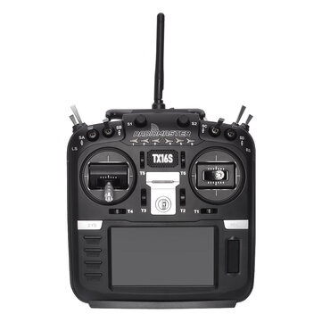
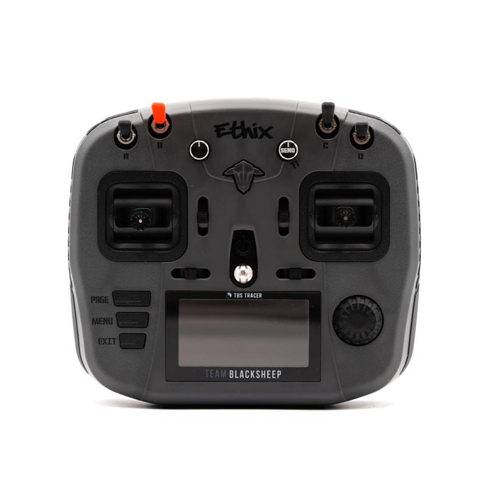
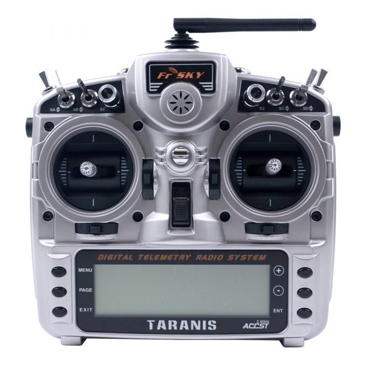
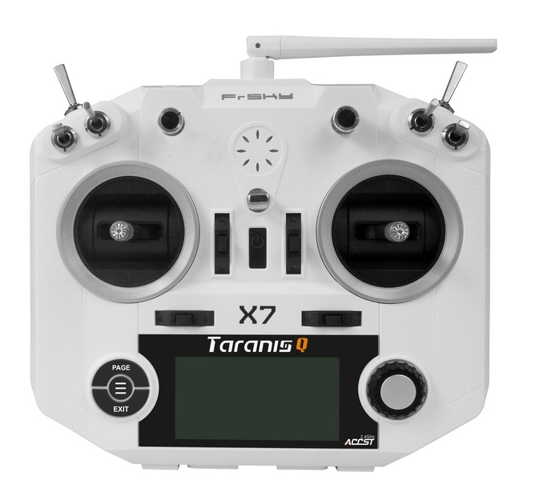

In questo articolo confronto i migliori simulatori per droni FPV per PC e Mac. I simulatori di droni esistono da un paio di decenni, ma solo recentemente hanno iniziato ad esser sufficientemente realistici per esercitarsi sia in gare che in freestyle con droni FPV. 

<!-- 
<a class="btn btn-discord" href="https://discord.gg/7ccZu2w" rel="nofollow" target="_blank">UNISCITI ORA!</a>
 -->

## Cos'è un simulatore FPV?

Un simulatore FPV è uno strumento che, attraverso un computer, ti permette di imparare a volare con droni da gara in ogni momento, in ogni posto, indipendentemente dal tempo che c'è fuori. Ma la cosa più importante è che puoi crashare quante volte vuoi senza danneggiare nulla.

Usare un simulatore è il modo perfetto per migliorare le tue abilità. Sia che tu sia un principiante e stai ancora imparando come non schiantarti sia che tu sia un esperto che vuole imparare a fare un nuovo trick complesso, i simulatori sono di grande aiuto.

Se sei un principiante, ecco un articolo da cui puoi inziare per [entrare nel mondo dell'FPV](https://lucafpv.com/fpv-per-principianti/).

## Radiocomandi

Per utilizzare questi simulatori devi avere un radiocomando compatibile.

Potresti anche semplicemente utilizzare un joystick normale oppure la tastiera, ma lo sconsiglio fortemente. Meglio utilizzare il radiocomando che userai anche per volare, in modo da poter sviluppare la "memoria muscolare" e ottenere il massimo dalla sessione di allenamento. 

Ecco una lista dei radio comandi più comuni in questo hobby, alcuni sono direttamente compatibili con i simulatori mentre altri richiedono l'acquisto di appositi adattori. 

> Qua puoi trovare una [guida all'acquisto dei i radiocomandi](https://lucafpv.com/migliori-radiocomandi-per-droni-fpv) e i prodotti che consiglio.

|                                                              | Radiocomando                                                | USB?                       |
| ------------------------------------------------------------ | ----------------------------------------------------------- | ------------------------------------------ |
|  | <a href="https://www.banggood.com/custlink/3KGECktftG" target="_blank" rel="noopener nofollow noreferrer">RadioMaster TX16</a>                                                 | ✔                                         |
|  | <a href="https://drone24hours.com/product/ethix-mambo-controller-per-drone-radio-fpv-rc/?D24H=lucapalonca" target="_blank" rel="noopener nofollow noreferrer">TBS Mambo</a>                                                     | ✔                                         |
|  | <a href="https://www.banggood.com/custlink/GDDRCUF7IJ" target="_blank" rel="noopener nofollow noreferrer">Taranis X9D Plus</a>                                             | ✔                                         |
|  | <a href="https://www.banggood.com/custlink/vGmRcqt7Zw" target="_blank" rel="noopener nofollow noreferrer">Taranis Q X7</a>                                                | ✔                                         |

Scegliere un radiocomando che supporta direttamente i simulatori FPV tramite cavo USB è molto più comodo. Ricorda inoltre che il radiocomando è una delle poce cose su cui investire facendo un buon acquisto, perché idealmente lo vorrai utilizzerai con tutti i tuoi quad.

Al momento, i migliore radiocomando economico è il <a href="https://www.banggood.com/custlink/vGmRcqt7Zw" target="_blank" rel="noopener nofollow noreferrer">Taranis Q X7</a>. Mentre il migliore per chi inizia è <a href="https://drone24hours.com/product/ethix-mambo-controller-per-drone-radio-fpv-rc/?D24H=lucapalonca" target="_blank" rel="noopener nofollow noreferrer">TBS Mambo</a>, molto valido, ma più costoso, sono l'<a href="https://www.banggood.com/custlink/GDDRCUF7IJ" target="_blank" rel="noopener nofollow noreferrer">X9D Plus</a>. Il grosso vantaggio è che funzionano semplicemente connettendo il cavo USB e i principali sistemi operativi li supportano come Joystick.

## La fisica del simulatore è importante?

Si e no.

La fisica di un simulatore di volo per droni è un soggettiva. I simulatori con i vari aggiornamenti continuano sempre ad avvicinarsi all'esperienza reale, ma non saranno mai come volare veramente.

Lo scopo del simulatore è aiutare il pilota nell'imparare a volare è a sviluppare la "memoria muscolare" per effettuare certe manovre. Scegli un simulatore che ti sembra abbastanza reale, con una grafica che ti piace e che possa funzionare in maniera fluida sul tuo computer. 

Passa piu tempo ad esercitarti piuttosto che preoccuparti della fisica del simulatore 😁

## I principali simulatori FPV

Di seguito riporto alcuni dei simulatori di volo più famosi, progettati appositamente per gare in FPV e volo freestyle acrobatico. 

|                                                              | **Prezzo** | Fisica | **Multiplayer** | **Crea Piste** | Sistema Operativo   | **Steam?** |
| :----------------------------------------------------------- | ---------- | :----: | :-------------: | :------------: | ------------------- | :--------: |
| [Orqa FPV.Skydive](https://store.steampowered.com/app/1278060/FPVSkyDive/) | Gratis        |   Sopra la media    |        ✖️        |       ✖️        | Windows, Mac, Linux |     ✔      |
| [FPV FreeRider](https://store.steampowered.com/app/854250/FPV_Freerider/) | 5 €        |   Discreta    |        ✖️        |       ✖️        | Windows, Mac, Linux |     ✔      |
| [Liftoff](https://store.steampowered.com/app/410340/Liftoff_FPV_Drone_Racing/) | 20 €       |   Buona    |        ✔        |       ✔        | Windows, Mac, Linux |     ✔      |
| [Uncrashed](https://store.steampowered.com/app/1682970/Uncrashed__FPV_Drone_Simulator/) | 13 €       |   Buona    |        ✖️        |       ✖️        | Windows, Mac, Linux |     ✔      |
| [VelociDrone](http://www.velocidrone.com/)                   | 19 €       |   Eccellente    |        ✔        |       ✔        | Windows, Mac, Linux |     ✖️      |
| [DRL Racing](https://store.steampowered.com/app/641780/The_Drone_Racing_League_Simulator/) | 9 €        |   Discreta    |        ✔        |       ✔        | Windows, Mac, Linux |     ✔      |

## Orqa FPV.Skydive

> Simulatore gratuito con funzionalità limitate, ma una buona fisica

<lite-youtube videoid="EihIDK8bVB8" params="start=38"/>

**Orqa FPV.Skydive** è il miglior simulatore FPV gratuito. Al momento ci sono solo 5 livelli, ma sembra che gli aggiornamenti siano regolari. In generale, rispetto agli altri simulatori in questa lista le mappe disponibili sono meno complesse, ma non ci si annoia.

La fisica è sopra la media, specialmente la simulazione del prop wash è fatta davvero bene. L'unico svantaggio di questo simulatore è che la parte di racing è poco sviluppata e non è disponibile in multiplayer.

## FPV FreeRider

> Costa poco e poche funzionalità di simulazione, va bene per principianti, ma è un po' vecchio

<lite-youtube videoid="WACcq2ykgNo"/>

Questo è uno dei primi simulatori di volo pensato per droni FPV. 

**FPV Freerider** costa poco e ha anche una versione di prova gratuita. Il simulatore permette di cambiare qulache impostazione base relativa alla fisica nel gioco, come ad esempio gravità, attrito e potenza del quadricottero. Altre impostazione permettono di aggiustare l'inclinazione della camera e il campo visivo (FOV). Nella versione gratuita non è possibile cambiare le impostazioni e si può volare solo in una mappa.

FPV Freerider ha una fisica abbastanza reale. Tuttavia il sistema di rates del quad è un po' deludente. Non ha il "super rate" e quindi il drone sembra muoversi molto lentamente per un volo in modalità acro. Inoltre si ha la sensazione che ci sia un po' di ritardo negli input. Infine, è un peccato che non sia possibile giocare in multiplayer. 

Va bene per principianti che vogliono provare a volare in FPV, ma ha molte limitazioni.

## Liftoff

> Un simulatore molto curato, con aggiornamenti frequenti e molti contenuti, ma richiede un buon PC da gaming 

<lite-youtube videoid="VuPwux4hiL4" params="start=4"/>

Per i piloti piu esperti, **Liftoff** è un buon simulatore. E' uno dei migliori sia in termini di grafica e che di funzioni. Il numero di contenuti è veramente impressionante, centinaia di modelli e migliaia di mappe create dalla community. Liftoff permette di cambiare componenti e impostazioni come nel mondo reale. Inoltre, è possibile aggiustare i rates e PID come se fossi su Betaflight. La fisica è migliora di aggiornamento in aggiornamento. Ingenieri aerodinamici e i migliori piloti al mondo hanno collaborato con gli sviluppatori per migliorare questo prodotto. 

Liftoff è anche il simulatore con la miglior grafica, e richiede un PC da gaming con buone performance per ottenere il massimo e girare in maniera fluida. Se hai un computer vecchio oppure un computer portatile, questo simulatore non fa per te.

Sfortunatamente non è possibile cambiare nessuna impostazione relativa alla fisica. Inoltre, a volte il gioco non rileva correttamente i crash e quindi devi resettare la posizione del drone manualmente tramite la tastiera. Nulla di grave, ma un po' fastidioso. 

Liftoff ha semplificato molto il procedimento con il quale è possibile connettere il tuo radiocomando e ha anche introdotto la modalità Freestyle, una gara acrobatica nel quale ad ogni trick ti viene attribuito un punteggio bastato sulla perfezione di esecuzione della manovra. 

## Uncrashed 

> Considerato uno dei migliori simulatori per freestyle con un ottima grafica

<lite-youtube videoid="1ct11sPC5pQ"/>

Una volta liftoff era il simulatore per eccellenza per i piloti FPV che si volevano allenare in freestyle. Ma **Uncrashed** ha cambiato le carte in tavola!
Le mappe e i livelli presenti in questo simulatore sono davvero divertenti e perfetti per il freestyle. Un sacco di ostacoli da usare per fare tanti trick spettacolari.

L'unica pecca è l'assenza di multiplayer.

## VelociDrone

> Fisica molto buona, uno dei simulatori più realistici. Non la miglior grafica ma funziona bene anche su computer lenti

<lite-youtube videoid="vIxbM5oWeRI" params="start=6"/>

Se hai un computer vecchio oppure un portatile, dovresti provare **VelociDrone**.

VelociDrone ti da la possibiltà di sceglire tra molti modelli reali e aggiustare le impostazioni della fisica di gioco.

E' il simulatore con la miglior fisica è altamente personalizzabile. Con la possibilità di aggiustare così tante impostazioni, puoi aver la sensazione di volare con il tuo quad. Probabilmente uno dei migliori simulatori in questo elenco per quanto sia simile alla sensazione di volo reale.

Questo simulatore usa parti del codice del firmware di Betaflight, e in questo modo è possibile aggiustare PID and rates esttamente come se fossi su Betaflight. Il campo di vista (FOV) e l'inclinazione possono essere settate come preferisci. 

La grafica non è delle migliori, ma velocidrone punta più a girare in modo fluido anche su computer portatili. Tra le funzionalità troviamo la creazione di circuiti e la possibiltà di giocare in multiplayer dove è possibile scegliere tra gare e competizioni freestyle. 

L'unica pecca è che non è disponibile su Steam, quindi l'aggiornamento non è automatico e richiede qualche passo in più, ma questo può anche essere un vantaggio se non vuoi installare un aggiornamento. 

Ad ogni modo, velocidrone è considerato il simulatore standard per tutti i piloti racing, dal momento che è possibile partecipare alle qualificazioni dei campionati Multi GP.

## DRL Racing

<lite-youtube videoid="x5NE0qUWuk4" params="start=12"/>

**DRL (Drone Racing League)** è un simulatore interessante – nel gioco ci sono eventi online e i piloti migliori possono vincere contratti da pilota professionisti e gareggiare in eventi reali. 

La fisica non è delle migliori ma è migliorata di molto dalle precedenti versioni gratuite. Uno delle maggiori migliorie riguarda la modo in cui si curva, ma il quad sembra ancora non sufficientemente potente. DRL ha modellato i droni che vengono utilizzati nelle loro gare che pesano più di 1 kg.  

Le mappe sono stupende, ci sono edifici di tutti i tipi e ovviamente anche scenari con alcuni bando. Un'altra bella funzionalità è la possibilità di ricominciare la gara utilizzando uno switch sul radiocomando.  

Carino il fatto che si possa gareggiare con "fantasmi" di altri piloti che del tuo stesso livello. Questo aiuta molto a migliorare le tua abilità. 

## Tuning nel simulatore

Quasi tutti i simulatori FPV permettono di aggiustare i rates e PID, oltre che a cambiare impostazioni relativa alla fisica. Lo scopo è quello di ottenere l'esperienza più simile al volo reale. Tuttavia queste impostazioni sono pensate prevalentemente per piloti con più esperienza.

Se voli da poco tempo, è meglio lasciare tutte le impostazioni di default a meno che qualcosa non funzioni. Le uniche impostazioni che dovresti cambiare sono i rates e l'expo, che sono essenzialmente la sensibilità rispetto ai comandi dati dagli stick. <!-- Leggi questo articolo per maggiori dettagli -->

Se invece vuoi approfondire l'argomento dai un'occhiata a questi articoli su [cosa sono i rates](https://lucafpv.com/spiegazioni-rates) e [come tunare i PID](https://lucafpv.com/come-tunare-pid).

## Occhiali FPV e Simulatori

Ci si potrebbe chiedere se allenarsi con gli occhiali FPV possa fare molta differenza. Tipicamente non fa questa grossa differenza. Io personalmente trovo più comodo volare semplicemente guardando il monitor del computer, semplicemente perchè ho meno cavi in giro. 

La maggior parte degli occhiali di alta fascia, come Fatshark e Skyzone hanno la possibiltà di ricevere input HDMI. Questo permette di duplicare o estendere lo schermo del computer, come se fosse un monitor esterno. 

## Conclusioni

Se sai volare veloce in un simulatore, non è detto che tu sia capace di fare lo stesso nel mondo reale. Come tutte le cose, volare in FPV richiede allenamento e pazienza.

Bisogna capire che lo scopo dei simulatori è aiutare a formare una "memoria muscolare" nel controllare il drone attraverso gli stick del radio comando. Un buon modo per imparare nuovi trick senza rischiar di distruggere il quad 😁 

Usare i simulatori è un buon modo per entrare nel mondo FPV, un'alternativa potrebbe volare con un drone di piccola taglia. 

I simulatori migliorano di continuo, ma volare in un videogioco non sarà mai come volare per davvero.

Il modo migliore per imparare è uscire e volare, incontrare altri piloti e divertirsi. 
