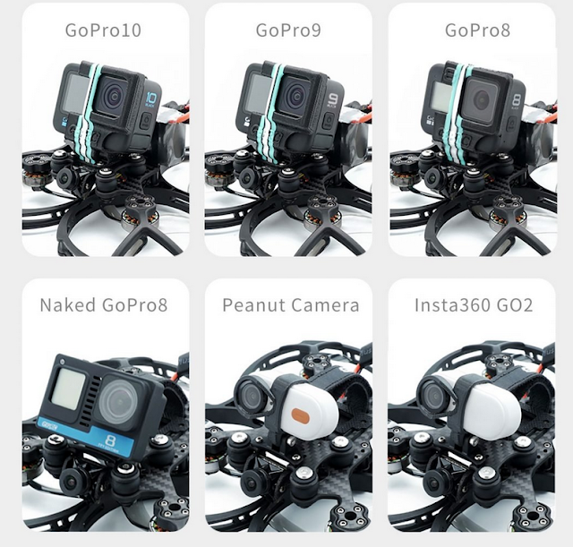
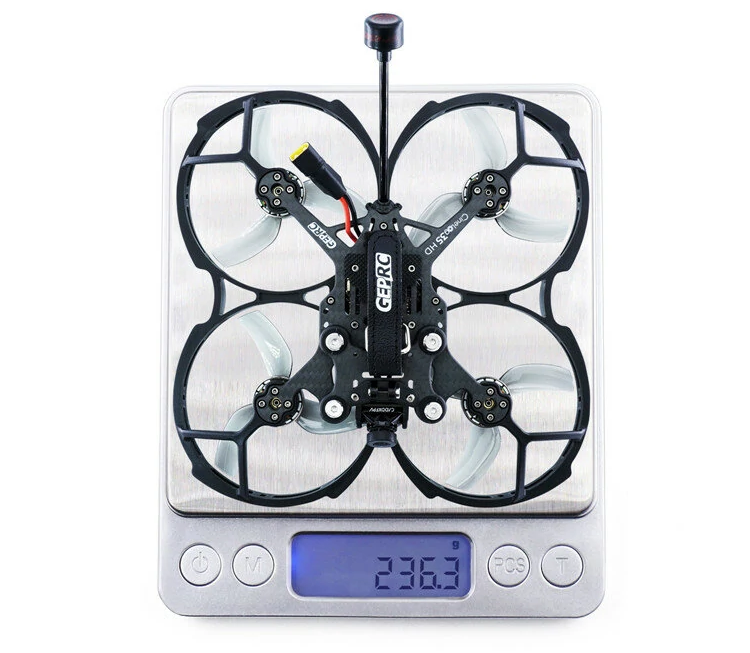
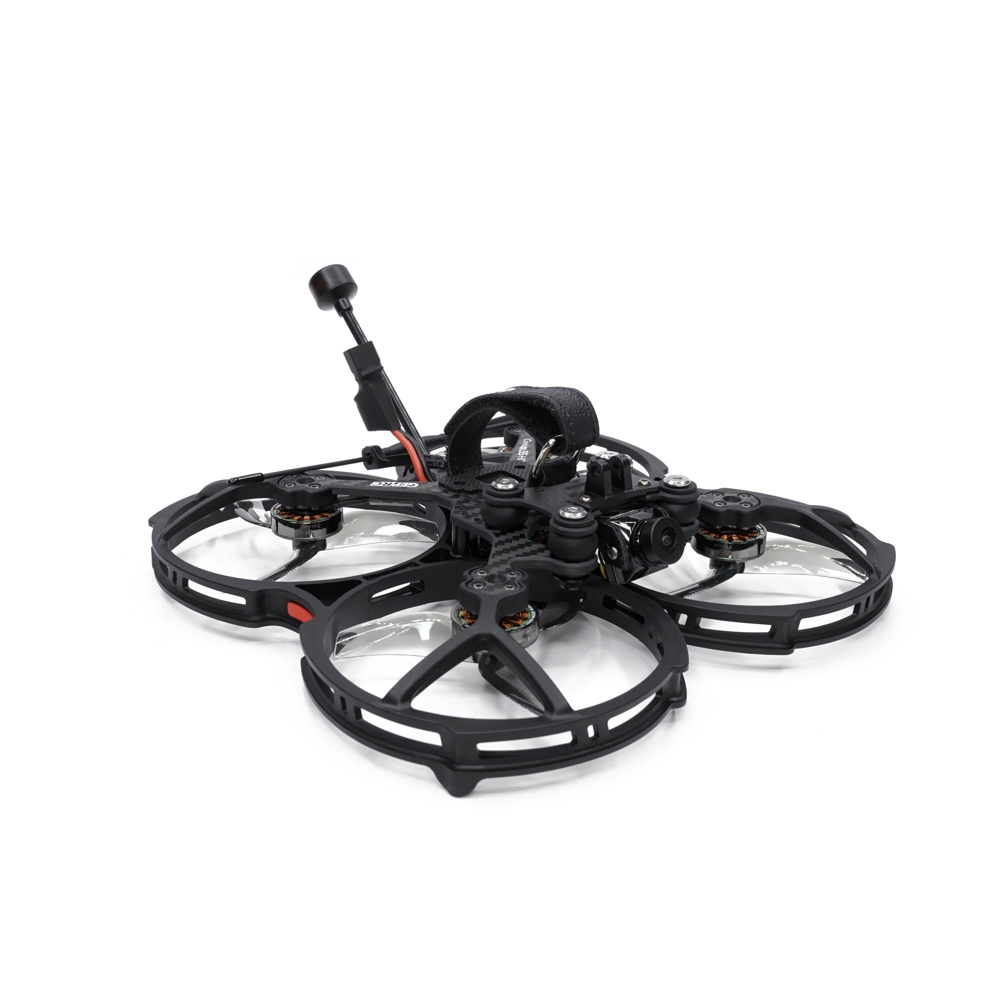

import YouTubeEmbed from "../../components/blog/youtube-embed.js"
import AffiliateLink from "../../components/blog/affiliate-link.js"

I video cinematic FPV sono sempre più richiesti a livello professionale, e sempre più virali sui social! A questo proposito, mi segui già su [Instagram](https://instagram.com/iamlucafpv)?

Un video cinematic che ha spopolato è quello realizzato da Jay Christensen:

<YouTubeEmbed link="https://youtu.be/VgS54fqKxf0?t=3"/>

Per realizzare questo tipo di video, è necessario utilizzare un tipo di drone FPV, chiamato cinewhoop, come appunto il nuovo <AffiliateLink href="https://www.drone24hours.com/product/geprc-cinelog35-hd/?D24H=lucapalonca" label="GEPRC Cinelog 35" />.

## Cos'è un cinewhoop?

Un cinewhoop è un tipo drone FPV di piccole dimensioni adatto per le riprese di interni e pensato per volare in sicurezza vicino a persone. 

Infatti, una caratteristica inconfondibile dei cinewhoop sono i duct, ovvero una struttura in plastica che protegge le eliche. 

Qualche anno fa, i duct erano stati introdotti principalmente per aumentare le performance di volo, ma solo pochi modelli ne beneficiavano realmente. 

Ultimamente si sono affermati di più i cinewhoop con configurazione pusher, ovvero con i motori montati a testa in giù. Questo fa in modo che il flusso d'aria generato dalle eliche non sia disturbato e si ottengano performance decisamente migliori, come nel caso di questo Cinelog 35.

## Cosa c'è nella scatola?

GEPRC nella scatola come al solito, oltre al drone, ci fornisce qualche pezzo di ricambio e diversi accessori. 

- 2 set di eliche D90-3
- 1 battery strap BM15x200mm
- 2 pad in silicone per le batterie
- 2 tappetini per l'atterraggio
- 4 anelli per attutire le vibrazioni
- 1 mount per montare la camera
- 1 set di viti extra e un cacciavite

## Versioni disponibili

Le versioni disponibili si differenziano per la potenza, versione 6S o 4S, e per il sistema video: digitale o analogico. 

Per quanto riguarda la potenza, consiglio personalmente la versione 6S perchè è dotata di motori da 1750KV. È anche possibile l'utilizzo di una batteria Li-ion 6S da 3000 mAh, sempre della GEPRC, con in teoria un'autonomia di volo che dovrebbe aggirarsi intorno ai 20 minuti. Un record per la categoria anche se il peso aggiuntivo e il tipo di batteria, basata sulle 18650, renderanno il CineLog 35 un po' meno reattivo rispetto alle configurazioni consigliate. 

### Versione Analogica
Il CineLog 35 analogico è dotato di camera Caddx Ratel2 con una VTX a 5.8GHz da 600 mW. Pesa 220,5 grammi senza batteria. 

### Versione Digitale 
La versione digitale CineLog 35 HD è equipaggiata con una camera Nebula Pro collegata alla Air Unit Vista Caddx, l'antenna è una Momoda LHCP da 17,5 cm. Il tutto ovviamente compatibile con il sistema DJI FPV e i relativi Goggles. Il peso senza batteria è di circa 236 grammi, non tanto più pesante rispetto alla versione analogica.

## Quali camere supporta?

Il nuovo Cinelog 35 di GEPRC è pensato per montare una grande varietà di camere. Sia che esse siano full o anche naked (una camera naked è una camera a cui sono stati rimossi componenti non fondamentali per il volo FPV, come batteria, schermi, struttura protettiva e GPS).

Questo drone riesce tranquillamente a sollevare il peso di una GoPro Hero 10, e di conseguenza con meno fatica può volare anche un tutte le versioni precedenti.

Naturalmente se si impiegano camere più leggere come le versioni naked, la Caddx Peanut o anche i 56 grammi della nuova DJI Action 2, ne beneficerà l'autonomia di volo che comunque è già buona, in particolare per la versione 6S del CineLog 35.

## Tempi di volo

|                                                                                                      | Batteria             | Senza Camera    | GoPro Hero 8 Naked | GoPro Hero 10  |
|------------------------------------------------------------------------------------------------------|----------------------|-----------------|--------------------|----------------|
| <AffiliateLink href="https://www.drone24hours.com/product/geprc-cinelog35-hd/?D24H=lucapalonca" label="Cinelog 35 Digitale" />      | LiPo 4S 1100mah 110C | 8 min e 30 sec  | 7 min e 30 sec     | 5 min          |
| <AffiliateLink href="https://www.drone24hours.com/product/geprc-cinelog35-analog/?D24H=lucapalonca" label="Cinelog 35 Analogico" /> | LiPo 6S 1100mah 60C  | 11 min e 30 sec | 8 min e 20 sec     | 7 min e 30 sec |

## Specifiche tecniche

Il CineLog 35 ha una diagonale di 14,2cm con un telaio in carbonio e con motori brushless 2004. I motori con le eliche Gemfan tripala D90-3, come dicevamo prima, sono in configurazione pusher per migliorare le performace di volo. Il flight controller è una F722-45A-AIO, con un ESC con firmware BLheli_S da 45A che per un drone di queste dimensioni è più che sufficiente. 

Per quanto riguarda il peso, il drone pesa meno di 250g senza batteria e senza camera. Tuttavia, aggiungendo una batteria leggera e l'utilizzo di una camera leggera come ad esempio la <AffiliateLink href="https://www.drone24hours.com/prodotto/caddx-peanut-action-camera/?D24H=lucapalonca" label="Caddx Peanut" />, sarà semplice superare il peso di 250g.

Entrambe le versioni possono essere acquistate senza RX (in questo caso quella digitale è utilizzabile con il radiocomando DJI FPV) oppure con R-XRS FrSky o con il Crossfire Nano TBS. Per quanto riguarda la ricevente, chiaramente la scelta dipende dal vostro radiocomando e dal vostro modulo di trasmissione, io consiglio sempre la TBS Nano.

## Dove comprarlo?

Personalmente consiglio sempre di acquistarlo su store italiani, in questo modo supportiamo realtà locali e abbiamo i nostri prodotti in pochissimo tempo.

Un negozio con il quale mi trovo davvero bene è Drone24Hours. Se vuoi supporatre gratuitamente il mio lavoro puoi usare questi link:
- <AffiliateLink href="https://www.drone24hours.com/prodotto/geprc-cinelog35-analogico/?D24H=lucapalonca" label="Versione analogica" />
- <AffiliateLink href="https://www.drone24hours.com/prodotto/geprc-cinelog35-hd/?D24H=lucapalonca" label="Versione digitale" />
