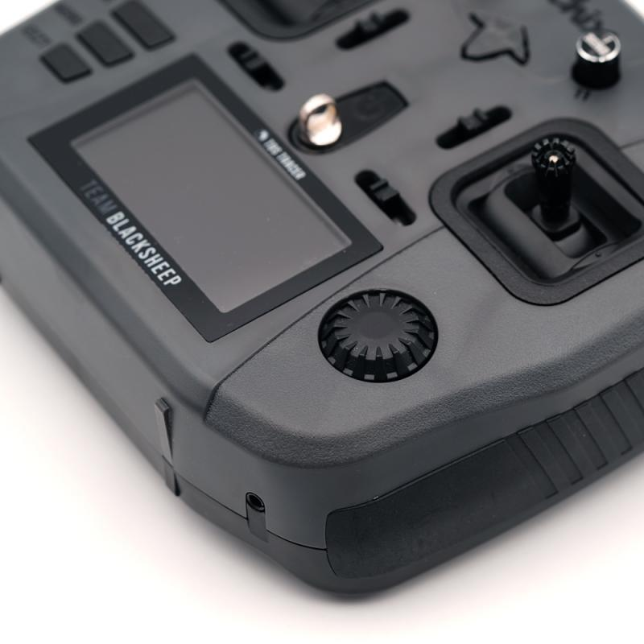

import AffiliateLink from "../../components/blog/affiliate-link.js"

La TBS Tango 2, il radiocomando di casa TBS a forma di gamepad ha fatto molto successo, ma non tutti trovano comodo quello stile di radio. Molti, sopratutto chi pilota con pollici e indici, preferisce una radio più grossa, con la forma dei radiocomandi normali.

Ed è per questo che quando la TBS Mambo è stata annunciata molti erano entusiasti, la qualità di TBS in una radio da dimensioni normali!

Tuttavia non è esattamente quello che hanno ottenuto. 

La TBS Mambo ha come modulo interno TBS Tracer e non TBS Crossfire e questo ha sollevato qualche dubbio su questa radio.

> Acquista TBS Mambo su <AffiliateLink href="https://drone24hours.com/product/ethix-mambo-controller-per-drone-radio-fpv-rc/?D24H=lucapalonca" label="drone24hours.com"/>, un negozio italiano che spedisce molto velocemente.

## Interruttori e bottoni

Sulla parte superiore della radio troviamo 4 switch a tre posizioni e 2 potenziometri. Sulle spalle della radio troviamo invece due bottoni. Quello di sinistra è un bottone a due posizioni, che molti utilizzeranno per armare il drone, mentre il bottone di destra è un bottone momentaneo, ovvero torna in posizione al momento del rilascio, e questo spesso viene usato per il beeper.

Inoltre, sempre sulla parte superiore della radio troviamo tre bottoni classici di OpenTX: page, menu e exit. Infine è presente anche una rotellina cliccabile che permette di navigare e selezionare le voci dei diversi menu.

## Moduli esterni

Sul retro della radio è presente un comparto per i moduli standard JR, quindi sarà possibile installare il moduli come Ghost, Crossfire e Express LRS, se si vuole utilizzare protocolli diversi da TBS Tracer che è nel modulo interno.

Il radiocomando è alimentato da due batterie 18650 che vengono inserite nella parte bassa sul retro della radio. **Le batterie NON sono incluse**. E' possibile poi caricare le batterie tramite cavo usb-c senza dover estrarre le batterie ogni volta.

## FreedomTX vs OpenTX

Su TBS Mambo, come su TBS Tango 2 gira FreedomTX una build custom di OpenTX sviluppata dal team di TBS. Tuttavia sarà molto familiare a tutti coloro che hanno utilizzato una radio OpenTX in passato. E' questo è ottimo perchè significa che tutte le guide su come configurare una radio OpenTX, che sia una Taranis, RadioMaster o TBS Mambo saranno identiche.

Tra gli script nella radio troviamo TBS Agent Lite che viene utilizzato per gestire tutti i dispositivi dell'ecosistema TBS. Questo è un bel bonus perchè in una radio OpenTX classica, questo script va installato a parte.

### Perché non è il massimo FreedomTX

Chiariamo subito, questo piccolo inconveniente con è dovuto TBS. In generale, tutti i radiocomandi OpenTX possono essere gestiti tramite un software chiamato OpenTX Companion. Tramite questo programma è possibile aggiornare, fare back up di tutte le radio OpenTX, in oltre è veramente semplice trasferire le impostazioni e i modelli da una radio all'altra.

Questo purtroppo non è possibile con la TBS Mambo. Dicevo che non è colpa di TBS, perché FreedomTX è nato con l'idea di essere un firmware temporaneo mentre si aspettava che gli sviluppatori di OpenTX integrassero i radiocomandi di TBS. Dopo diversi anni questa integrazione non è ancora avvenuta, per colpa della lentezza nello sviluppo di OpenTX.

Per aggiornare il firmware su FreedomTX, si utilizza quindi TBS Agent X.

Se stai iniziando e non hai radiocomandi vecchi, probabilmente questo non è un problema per te perchè non hai modelli e impostazioni da trasferire.

## Ergonomia

TBS ha fatto un ottimo lavoro sull'ergonomia di questa radio. Nelle mani non sembra così grande come ad esempio una RadioMaster TX16S ed è più arrotondata, che sembra essere meglio perchè quando devi riporla nello zaino non occupa poi cosi tanto spazio. 

Gli switch sono semplici da raggiungere. Forse potrebbe essere un po' troppo semplice schiacciare per sbaglio i bottoni sul retro se si appoggiano le dita li durante il volo. 

Sul retro del radiocomando ci sono delle protuberanze in gomma utili per avere una presa migliore.

## Gimbal

I gimbal sono di tipo Hall, quindi dovrebbero durare più a lungo nel tempo. Tuttavia questo è difficile da giudicare nel breve. 

Gli stick sono più corti rispetto ad altri radiocomandi, come ad esempio la RadioMaster TX16S, tuttavia questo non è un problema perchè si possono allungare svitandoli e bloccandoli successivamente.

Le dimensioni dei gimbal sono abbastanza simili ai radiocomandi standard, quindi anche con la TBS Mambo abbiamo molta precisione.

## Tracer vs Crossfire

All'interno della nuova TBS Mambo è presente TBS Tracer al posto di TBS Crossfire. Questa scelta ha sollevato molti dubbi.

### TBS Tracer
E' il nuovo sistema di controllo radio sviluppato da TBS. Tra le caratteristiche principali troviamo sicurmente la bassa latenza. Questo si traduce in un controllo più immediato del drone. TBS Tracer dunque è amato da coloro che fanno gare o si divertono con il freestyle veloce. Tuttavia, dal momento che viene trasmesso sui 2.4 GHz, non ha un range fenomenale, in condizioni reali parliamo di un paio di chilometri.

### TBS Crossfire
Il primo sistema di controllo radio sviluppato da TBS. Dato che viene trasmesso sui 900 MHz, questo segnale ha ottime capacità di penetrazione e range di decine di chilometri. Queste sue caratteristiche lo rendono la scelta ovvia per piloti long range e freestyle.

### Perchè Tracer è una scelta controversa?
TBS Tracer è ancora nuovo, e moltissimi piloti utilizzano crossfire. Dunque non avendo nessun ricevente tracer, non possono usare il modulo interno perchè usano crossfire appunto.

La risposta di TBS alle critche sollvenate è che per coloro che volano con crossfire, a meno che siano possessori di TBS Tango 2, hanno un modulo esterno TBS Crossfire che possono inserire sul retro della radio.

## La versione Ethix

La marca di Mr. Steel, in collaborazione con TBS ha personalizzato questa radio, e nella versione Ethix in più si ottiene: 

- Un colore grigio corazzato
- Le impugnature laterali meno scivolose
- Cappucci in silicone per gli switch
- Tracolla Ethix
- Stickers

Sono solamente modifiche estetiche, che personalmente penso facciano molta scena.

## Dovresti comprarla?

Questo radiocomando costa circa 200 euro, è considerando il fatto che all'interno c'è un modulo TBS Tracer che da solo vale 90 euro, porta il valore della radio poco sopra i 100 euro, che è davvero un ottimo prezzo per la qualità di questa radio.

Se stai iniziando e non hai ancora un radiocomando, allora TBS Mambo è la scelta ideale per te. Tutte gli altri radiocomandi scelti dai principianti, non hanno TBS Tracer incluso. Questo significa che sarai bloccato nell'ecosistema di FrSky presumibilemente, e quindi il range tipo sarà circa 800 metri, dopo i quali il drone cadrà a terra per mancanza di segnale.

Drone24Hours, per i pricinpianti a pensato a questo fantastico bundle, che incluse un radiocomando e tre ricevente, <AffiliateLink href="https://www.drone24hours.com/product/ethix-mambo-starter-set/?D24H=lucapalonca" label="puoi comprarlo qua"/>.

Se invece hai già droni che montano TBS Crossfire e hai un modulo esterno, allora può valere la pena acquistarlo. E' un ottimo radiocomando con un alta qualità costruttiva. A questo prezzo, anche se non intendi usare il modulo TBS Tracer, non c'è molto che compete direttamente con la TBS Mambo.

